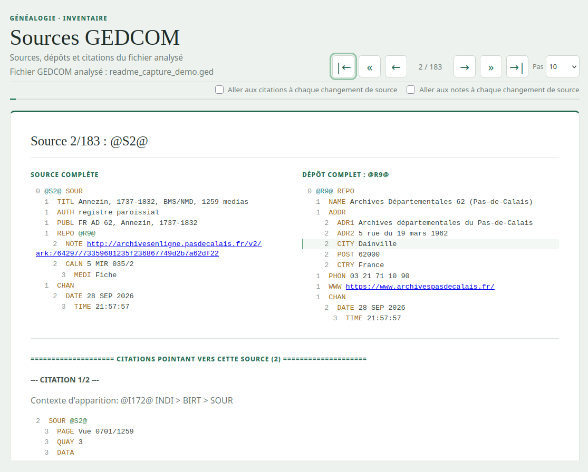
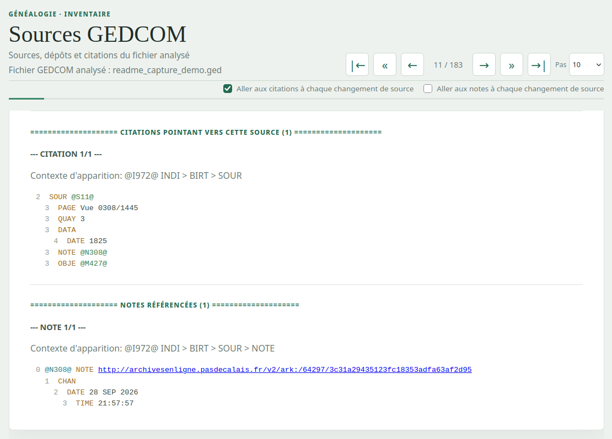
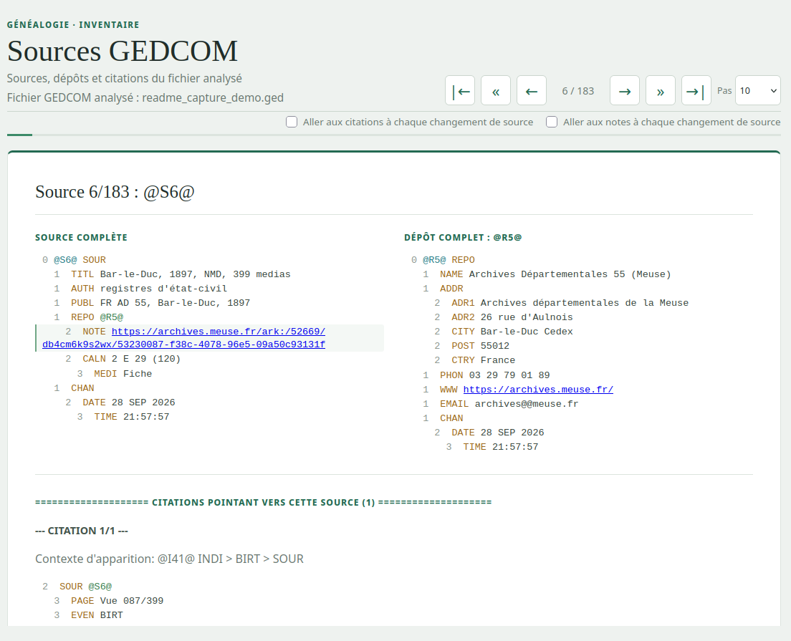

# Rapports de sources GEDCOM

Ce projet lit un fichier de généalogie au format GEDCOM et produit des rapports sur les sources (`SOUR`), les dépôts d'archives (`REPO`), les notes liées (`NOTE`) et les citations qui pointent vers les sources. Le rapport peut être affiché dans le terminal ou généré en HTML.

Le programme ne modifie pas le fichier GEDCOM d'origine. Les rapports peuvent toutefois contenir des données personnelles provenant de ce fichier : garde-les dans un emplacement privé et ne les publie pas sans vérifier leur contenu.

## Sommaire

- [Prérequis](#prérequis)
- [Démarrage rapide](#démarrage-rapide)
- [Repères GEDCOM](#repères-gedcom)
- [Utilisation en ligne de commande](#utilisation-en-ligne-de-commande)
- [Utilisation avec Make](#utilisation-avec-make)
- [Fichiers produits](#fichiers-produits)
- [Fonctionnement du projet](#fonctionnement-du-projet)
- [Tests et vérifications](#tests-et-vérifications)
- [Encodage](#encodage)
- [Dépannage](#dépannage)
- [Limites connues](#limites-connues)

## Prérequis

- Python 3.8 ou une version plus récente.
- `make` seulement si tu souhaites utiliser les raccourcis du `Makefile`.
- Aucun paquet Python externe n'est nécessaire : le projet utilise la bibliothèque standard de Python.

Il n'y a pas d'étape d'installation particulière ni de fichier de dépendances. Place-toi dans le dossier du projet avant d'exécuter les commandes ci-dessous.

## Démarrage rapide

Pour afficher le rapport complet dans le terminal :

```bash
python3 main.py "/chemin/vers/mon-fichier.ged"
```

Pour générer le rapport HTML :

```bash
python3 main.py "/chemin/vers/mon-fichier.ged" --mode all-html
```

Le fichier HTML est créé dans `resultats_html/report_all_html.html`, à côté de `main.py`. Ouvre ce fichier dans un navigateur pour consulter le rapport.
Si ce rapport existe déjà, il est remplacé.

Voici trois vues du rapport, générées avec des données fictives.

### Aperçu d'une source



### Notes référencées



### Navigation entre les sources



Remplace le chemin d'exemple par celui de ton fichier GEDCOM. Les guillemets sont importants si le chemin contient des espaces. Sous Windows, tu peux par exemple utiliser `python main.py "C:\\Genealogie\\famille.ged"`.

## Repères GEDCOM

Quelques notions aident à comprendre les rapports :

- Un **enregistrement** commence par une ligne de niveau `0`. Il peut représenter une source (`SOUR`), un dépôt (`REPO`), une note (`NOTE`), une personne (`INDI`) ou une famille (`FAM`).
- Un **XREF** est l'identifiant d'un enregistrement, écrit entre `@`, par exemple `@S1@`. D'autres lignes peuvent utiliser cet identifiant pour pointer vers l'enregistrement.
- Une **citation** est ici une ligne `SOUR @S1@` repérée dans un enregistrement GEDCOM : elle pointe vers la source identifiée par `@S1@`. Ce n'est pas l'enregistrement de source lui-même, qui est généralement une ligne de niveau `0`, par exemple `0 @S1@ SOUR`.
- Une **note inline** contient directement son texte. Une note référencée utilise un XREF, par exemple `NOTE @N1@`, qui pointe vers un enregistrement `NOTE` défini ailleurs dans le fichier.

## Utilisation en ligne de commande

La forme générale est :

```text
python3 main.py FICHIER.ged [options]
```

Le fichier GEDCOM est obligatoire. Si aucun mode n'est précisé, le mode `all` affiche le rapport complet en texte dans le terminal.

### Modes disponibles

| Mode | Résultat |
| --- | --- |
| `all` | Chaque source, ses notes et dépôts associés, ainsi que les citations qui pointent vers elle. C'est le mode par défaut. |
| `sources` | La liste des enregistrements de sources (`SOUR`). |
| `depots` | La liste des enregistrements de dépôts (`REPO`). |
| `citations` | Les références repérées dans le fichier, classées selon qu'elles pointent ou non vers une source connue. Voir les limites connues : toutes les références GEDCOM ne sont pas des citations de sources. |
| `sources_and_deposits` | Chaque source avec ses dépôts associés. |
| `sources_and_citations` | Chaque source avec les références qui pointent vers elle. |
| `all-html` | Génère un rapport HTML complet, parcourable source par source. |

Dans les modes qui affichent les sources et leurs citations, les références `NOTE` vers un enregistrement `NOTE` de niveau `0` défini dans le fichier sont regroupées dans une seule section `NOTES RÉFÉRENCÉES (n)` par source. Le total et la numérotation incluent les références de la source et de toutes ses citations ; leur contexte d'apparition permet de distinguer leur origine. Le mode `citations` applique le même regroupement par source connue, ou par XREF cible pour les citations inconnues. Les modes limités aux sources sans citations ne comptent que les références de la source. Les notes inline restent affichées dans l'arbre GEDCOM, et les références sans cible correspondante ne sont pas listées séparément.

Dans le rapport HTML, les boutons `|←` et `→|` affichent respectivement la première et la dernière source. Les flèches simples passent à la source précédente ou suivante ; les chevrons `«` et `»` reculent ou avancent selon le pas choisi. Le sélecteur `Pas` propose des sauts de 10, 20, 30, 40 ou 50 sources. Le compteur et la barre de progression indiquent la position courante. Les commandes qui dépasseraient la première ou la dernière source sont désactivées. Les cases à cocher permettent d'aller automatiquement aux citations ou aux notes après chaque changement de source. Cocher l'une décoche automatiquement l'autre. Sur petit écran, la barre de navigation reste sur une seule ligne. Les URL commençant par `http://` ou `https://` présentes dans les valeurs GEDCOM y sont cliquables et s'ouvrent dans un nouvel onglet.

Exemples :

```bash
# Lister uniquement les sources
python3 main.py "famille.ged" --mode sources

# Lister les dépôts sans couleurs ANSI
python3 main.py "famille.ged" --mode depots --no-color

# Afficher les sources avec leurs dépôts, sans indentation
python3 main.py "famille.ged" --mode sources_and_deposits --no-indent

# Enregistrer le rapport texte complet dans un fichier
python3 main.py "famille.ged" --mode all --no-color --no-indent > "rapport.txt"
```

### Options

| Option | Effet |
| --- | --- |
| `--mode MODE` | Choisit l'un des modes listés ci-dessus. |
| `--no-color` | Désactive les couleurs ANSI dans les rapports texte. Sans effet sur le rapport HTML. |
| `--indent N` | Définit le niveau GEDCOM de départ pour l'indentation du rapport texte. La valeur par défaut est `0`. |
| `--no-indent` | Désactive l'indentation des lignes dans les rapports texte. Cette option prend le dessus sur `--indent`. |
| `--encoding NOM` | Choisit l'encodage du fichier. La valeur par défaut, `auto`, essaie plusieurs encodages courants. |
| `-h`, `--help` | Affiche l'aide de la commande. |

Pour obtenir la liste exacte des options installées dans cette version :

```bash
python3 main.py --help
```

Les noms d'encodage explicites acceptent les codecs connus de Python, par exemple `utf-8` ou `cp1252` :

```bash
python3 main.py "famille.ged" --encoding cp1252
```

## Utilisation avec Make

Le `Makefile` fournit des raccourcis. Depuis la racine du projet, il utilise par défaut le fichier GEDCOM suivant :

```text
./gedcom-test.ged
```

Pour utiliser un autre fichier, renseigne la variable `GEDCOM` :

```bash
make GEDCOM="/chemin/vers/famille.ged"
```

Commandes disponibles :

```bash
# Génère les rapports HTML et texte
make GEDCOM="/chemin/vers/famille.ged"

# Génère seulement le rapport HTML
make html GEDCOM="/chemin/vers/famille.ged"

# Génère seulement le rapport texte
make text GEDCOM="/chemin/vers/famille.ged"

# Exécute les tests unitaires
make test
```

Le programme Python utilisé par Make est `python3` par défaut. Il est possible d'en sélectionner un autre :

```bash
make text GEDCOM="/chemin/vers/famille.ged" PYTHON=python3.12
```

`make clean` supprime les rapports générés (`resultats_html` et `resultats_gedcom`) ainsi que les caches Python à la racine, dans `gedcom` et dans `tests`. Pour ne supprimer qu'une catégorie, utilise `make clean-reports` pour les rapports ou `make clean-cache` pour les caches. Aucune de ces cibles ne supprime le fichier GEDCOM source.

## Fichiers produits

- `resultats_html/report_all_html.html` : rapport HTML interactif, généré par `--mode all-html` ou `make html`.
- `resultats_gedcom/sources_citations.txt` : rapport texte sans couleur, généré par `make text`.
- Tout autre rapport texte : envoyé sur la sortie standard. Tu peux le rediriger avec `>` vers le fichier de ton choix.

Les dossiers de résultats sont créés automatiquement lorsqu'un rapport y est écrit. Ils sont ignorés par Git.
La génération HTML remplace le rapport HTML précédent, et la cible `make text` remplace le rapport texte précédent.
Les rapports affichent le nom du fichier GEDCOM analysé, sans son chemin complet.

## Fonctionnement du projet

Le traitement suit ces étapes :

1. `main.py` vérifie les options et orchestre le traitement.
2. `gedcom/parser.py` lit le fichier et transforme les lignes GEDCOM en arbre de nœuds parent-enfant; il signale les XREF dupliqués et les lignes structurellement invalides.
3. `gedcom/analyzer.py` indexe les entités par type et résout les dépôts et notes liés aux sources et aux citations, puis regroupe les citations.
4. `gedcom/text_reporter.py` écrit un rapport texte, ou `gedcom/html_reporter.py` assemble le rapport HTML à partir du modèle et des fichiers de `web/`.

Repères dans le dépôt :

| Fichier | Rôle |
| --- | --- |
| `main.py` | Point d'entrée CLI et orchestration des étapes. |
| `gedcom/parser.py` | Décodage du fichier et construction des arbres GEDCOM. |
| `gedcom/analyzer.py` | Indexation des entités, résolution des dépôts et notes, et regroupement des citations. |
| `gedcom/utils.py` | Modèle des nœuds GEDCOM et opérations communes sur les arbres. |
| `gedcom/text_reporter.py` | Formatage et routage des rapports texte. |
| `gedcom/html_reporter.py` | Assemblage du rapport HTML autonome. |
| `tests/test_gedcom.py` | Tests unitaires du parseur, de l'analyse et des rapports. |
| `web/html_template.html` | Structure HTML de base. |
| `web/style.css` | Styles intégrés au rapport HTML. |
| `web/script.js` | Navigation entre les sources du rapport HTML. |
| `Makefile` | Raccourcis de génération et nettoyage des résultats. |

## Tests et vérifications

La suite de tests utilise `unittest`, fourni avec Python. Depuis la racine du projet, lance-la avec :

```bash
python3 -m unittest discover -s tests -v
```

Ou utilise le raccourci Make :

```bash
make test
```

Pour vérifier rapidement que les modules Python se compilent et que la commande démarre :

```bash
python3 -m compileall -q .
python3 main.py --help
```

Ces vérifications contrôlent la compilation et les options de la commande, mais n'analysent pas un fichier GEDCOM.

## Encodage

Avec `--encoding auto`, le lecteur essaie successivement `utf-8-sig`, `utf-8`, `cp1252` et `iso-8859-1`. Comme `iso-8859-1` peut décoder pratiquement n'importe quelle suite d'octets, le programme ne peut pas toujours détecter un encodage incorrect : le texte peut être lisible mais contenir des caractères erronés. Si c'est le cas, indique explicitement l'encodage avec `--encoding`.

## Dépannage

### Fichier introuvable

Vérifie le chemin passé à la commande. Un chemin contenant des espaces doit être placé entre guillemets. Pour Make, vérifie aussi la valeur de `GEDCOM`.

### Erreur d'encodage ou caractères incorrects

Essaie l'encodage du fichier explicitement, par exemple `--encoding utf-8` ou `--encoding cp1252`.

### Le rapport HTML n'apparaît pas

Vérifie que les fichiers `web/html_template.html`, `web/style.css` et `web/script.js` sont présents, puis relance la commande. Le chemin complet du rapport est affiché après sa génération.

### Le rapport ne contient aucune source

Le programme recherche les sources comme des enregistrements GEDCOM de niveau 0 portant le tag `SOUR` et une référence XREF. Vérifie que le fichier contient bien de tels enregistrements.

## Limites connues

- Les citations sont repérées à partir des valeurs `@identifiant@` portées par un tag `SOUR`. Le rapport les classe comme connues si l'identifiant correspond à une source `SOUR` de niveau `0` indexée ; sinon, elles sont classées comme inconnues. Ce contrôle ne constitue pas une validation complète de la conformité au standard GEDCOM.
- Le parseur ignore les lignes illisibles et les sauts de niveau, mais ne valide pas toutes les règles du standard GEDCOM. Une ligne non-niveau-0 rencontrée sans parent peut encore être conservée comme racine.
- Les XREF dupliqués sur des enregistrements de niveau `0` sont signalés avec les numéros de ligne concernés. L'analyse continue néanmoins ; pour un même type d'enregistrement, la dernière définition indexée peut remplacer la précédente dans les données utilisées pour le rapport.
